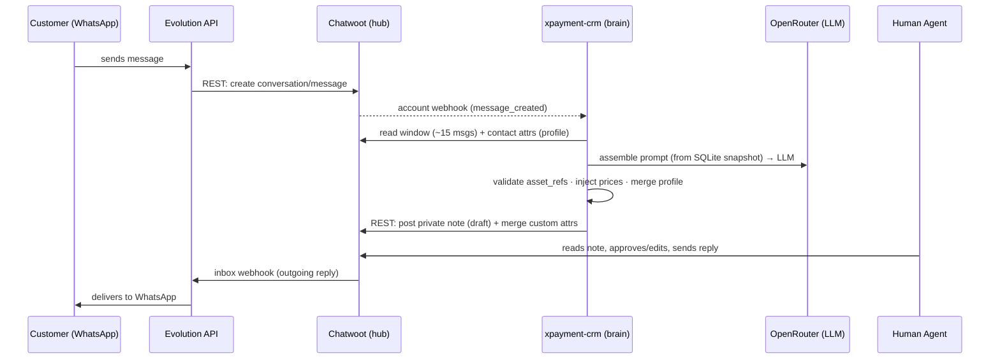

# xpayment AI Sales Copilot — Design Documentation

## What this is

[xpayment](https://xpayment.kz) is a Kaspi Pay integration for Kazakhstani merchants: connect a Kaspi virtual cashier and accept payments by QR, payment link, and remote invoice, plus a REST API (create payment, payment links, refunds, webhooks). Leads arrive from Instagram ads redirected to WhatsApp, and conversations happen in Russian or Kazakh.

This documentation set describes the **AI sales copilot** that supports those conversations. Incoming WhatsApp messages land in a shared team inbox (Chatwoot). A **standalone Go service** — the **brain**, which *is* the `xpayment-crm` project — reads the recent conversation and lead profile **from Chatwoot**, drafts a reply (answer text + which media to attach + what it learned about the lead) with an LLM (**via OpenRouter**), and writes that draft **back to Chatwoot as a private note** for a human to approve and send (**suggest-only**). The same service exposes a **built-in admin UI** (server-rendered Go templates + htmx) where you edit the bot's settings and knowledge base; its config lives in an **embedded SQLite** database. It depends on no other project.

This file is the canonical home for the **Decisions** and the **Architecture**. The other documents reference these and never restate them.

---

## Decisions

These are non-negotiable for v1. Other files refer to them as "per Decision N".

1. **Chatwoot is the single source of truth** for all conversational state: contacts, conversations, messages, status (labels), callbacks (snooze), and grouping (contact merge).
2. **Conversations live in Chatwoot; the brain owns only its config.** The brain stores **no** conversations, messages, or contacts (Chatwoot owns those). It keeps its **persona, guardrails, knowledge base, prices, and media metadata in an embedded SQLite database** inside `xpayment-crm`, edited through its **built-in admin UI**, and loaded into an immutable in-memory **snapshot** (hot-reloaded on publish). Media binaries are served from a local dir or object storage.
3. **Topology is hub-and-satellites.** Chatwoot is the hub; Evolution API and the brain are satellites that talk only to Chatwoot, never to each other.
4. **Channel-agnostic.** The brain's entry point takes a `chatID`; the same code serves WhatsApp now and any other channel later, because everything funnels through Chatwoot.
5. **WhatsApp gateway is Evolution API** (Baileys / unofficial WhatsApp Web). The official **Cloud API** is the documented migration path, gated behind a swappable adapter.
6. **Suggest-only in v1.** The brain returns a draft as a Chatwoot **private note**; a human approves and sends. A confidence threshold gates a later auto-send phase. The brain never sends to WhatsApp directly — Chatwoot does.
7. **No vector database.** Media and knowledge are selected by **LLM-as-selector**: the whole knowledge base and the whole media catalog are loaded into a cached prompt, and the model returns the names (refs) of the items it wants. The graduation path (topic-routing, then pgvector) is a documented future option, not used now.
8. **Prices are single-sourced.** Canonical numbers live in one place — the **`tariffs` table** (SQLite, [03](03-content-and-data.md)). Knowledge-base text contains only **tokens** like `{{price.growth}}` / `{{limit.growth}}`; the model never writes price/limit numerals; Go renders the real values **after** the model, from the `tariffs` table.
9. **Two memory horizons.** The **window** (last ~15 messages of the current conversation, fetched from Chatwoot) and the **profile** (structured lead facts stored as Chatwoot **contact custom attributes**, merged additively — overwrite a field on new confidence, never null a known one). No running summary in v1.
10. **Hexagonal / ports-and-adapters.** The brain talks to the outside through interfaces (`ContentSource`, `ChatwootReader`, `ChatwootWriter`, `Drafter`, `Prices`, `Catalog`), so the core is built and tested before any integration exists.
11. **Integration mechanism.** The brain receives events via a Chatwoot **account-level webhook** (`message_created`) and writes back via Chatwoot's **REST API** (private note + custom attributes). Chatwoot ↔ WhatsApp is bridged by Evolution's native Chatwoot integration. Chatwoot **AgentBot** is a documented alternative, but it puts conversations into a bot-managed "pending/handoff" state; the account-webhook is preferred for a persistent copilot.
12. **The brain is a standalone, full-stack service.** One Go service — the `xpayment-crm` project — exposes a **single port** carrying the Chatwoot **webhook** *and* a **built-in admin UI** (server-rendered Go `html/template` + **htmx**) for editing all settings + the knowledge base, backed by an **embedded SQLite** store. It has **no dependency on `xpayment-frontend`** and no separate content repo. The config lifecycle is the admin UI: **draft → publish → rollback** in the DB; publish hot-reloads the snapshot. Admin auth is a simple **same-service login** (no cross-service auth).
13. **LLM via OpenRouter, behind a provider-agnostic adapter.** The brain calls an **OpenAI-compatible** endpoint (**OpenRouter**) through the `Drafter` port. It is configured with **provider-neutral** env vars — `LLM_API_KEY`, `LLM_BASE_URL`, `LLM_MODEL`, `LLM_MAX_TOKENS` — never `OPENROUTER_*`/`OPENAI_*`/`ANTHROPIC_*`. Switching model or provider is a config change, not a code change.

---

## Architecture

### Hub-and-satellites

Chatwoot is the hub. Evolution and the brain are satellites; they never talk to each other (Decision 3).

```
                                  ┌──────────────────────────────────────┐
   ┌──────────┐    WhatsApp Web   │              CHATWOOT                 │
   │ Customer │◀────(Baileys)────▶│        (single source of truth)      │
   │ WhatsApp │                   │  contacts · conversations · messages │
   └──────────┘                   │  labels(status) · snooze(callback)   │
        ▲                         │  merge(grouping)                     │
        │                         └───┬───────────────▲──────────────────┘
        │ outgoing reply              │ account        │ REST write-back
        │ (inbox webhook)             │ webhook        │  • private note (draft)
        ▼                             │ message_       │  • contact custom attrs
   ┌──────────┐   REST (create       │ created        │    (profile)
   │ EVOLUTION│   conversation/msg)   ▼                │
   │   API    │──────────────────▶ ┌──────────────────┴──────────────────┐      ┌────────────┐
   └──────────┘                    │  xpayment-crm  (standalone service)  │────▶ │ OpenRouter │
   (satellite)                     │  • brain: HandleMessage → Draft      │ LLM_*│  (LLM)     │
                                   │  • admin UI (Go templates + htmx)    │      └────────────┘
                                   │  • embedded SQLite (config + KB)     │
                                   │  one port  (webhook + /admin)        │
                                   └──────────────────────────────────────┘
```

### Three layers

| Layer | Components | Responsibility |
|---|---|---|
| **Channel / transport** | Evolution API + Chatwoot | Move messages between the customer's WhatsApp and the shared inbox; own all conversational state. See [01-infrastructure.md](01-infrastructure.md). |
| **Brain** | The `xpayment-crm` Go service | On each inbound message, read context, decide *what to respond*, return a draft (via OpenRouter). See [02-assistant-brain.md](02-assistant-brain.md), [04-service-and-deployment.md](04-service-and-deployment.md). |
| **Content / config** | KB topics, media catalog, prices, persona — in **embedded SQLite**, edited via the **built-in admin UI** | The authored material the brain reasons from. See [03-content-and-data.md](03-content-and-data.md), [08-admin-ui.md](08-admin-ui.md). |

### Ownership

| Concern | Owner |
|---|---|
| Contacts | Chatwoot |
| Conversations | Chatwoot |
| Messages | Chatwoot |
| Status / pipeline stage | Chatwoot — **labels** |
| Callbacks / follow-up | Chatwoot — **snooze** |
| Grouping (numbers, employees) | Chatwoot — **contact merge** |
| Assistant config (persona, guardrails) | Go brain — **SQLite**, edited via the admin UI |
| Knowledge base (topics) | Go brain — **SQLite** (`kb_topics`) |
| Media metadata | Go brain — **SQLite** (`kb_assets`); binaries in a served dir / object storage |
| Prices | Go brain — **SQLite** (`tariffs`) — the single source |
| Lead profile / qualification | Computed by the brain → written to Chatwoot **contact custom attributes** |

The brain owns *the decision logic + the authored config*; Chatwoot owns *everything about the conversation*. The lead profile is the one piece the brain computes but does not store — it lives on the Chatwoot contact (Decision 9).

### End-to-end message flow



1. Customer sends a WhatsApp message.
2. Evolution (WhatsApp Web) receives it and **calls Chatwoot's REST API** to create the conversation/message.
3. Chatwoot fires the **account-level webhook** (`message_created`) to the brain (Decision 11).
4. The brain reads the **window** and the **profile** from Chatwoot using the `chatID` (Decision 9). First message vs. mid-conversation is not a code branch — it is just how much Chatwoot returns.
5. The brain assembles the prompt (cached prefix from the SQLite snapshot + dynamic suffix) and calls **OpenRouter**.
6. The brain post-processes: validate/resolve `asset_refs`, inject prices from the `tariffs` table, additively merge the profile, apply a status label.
7. The brain writes back via REST: a **private note** (the draft) plus **contact custom attributes** (the profile).
8. A human agent reads the note, approves or edits it, and sends the real reply in Chatwoot.
9. Chatwoot's **inbox webhook** carries the outgoing reply to Evolution → WhatsApp → customer.

### Named assumption

"Channel-agnostic" (Decision 4) holds **because everything funnels through Chatwoot**. The brain takes a `chatID` and never learns which transport produced it; adding Instagram or Telegram later is a Chatwoot inbox change, not a brain change. A future entry point that bypasses Chatwoot would reopen the question of where conversational state lives — out of scope for v1.

### Config lifecycle = the admin UI (consequence of Decision 12)

Persona, knowledge, prices, and the media catalog are edited in the **built-in admin UI** (server-rendered Go templates + htmx) and stored in **SQLite**. The lifecycle is **draft → publish → rollback** in the DB: you edit a draft, test it in the **Playground**, and **publish** to hot-reload the live snapshot; an audit log records who changed what. Because the UI and the API are the **same service**, auth is a simple same-service admin login — there is **no cross-service auth**. Details in [08-admin-ui.md](08-admin-ui.md).

---

## Repo layout (the standalone service)

`xpayment-crm` is the whole product — brain + admin UI + store, one binary. Hexagonal:

```
xpayment-crm/
  cmd/main.go                 # start HTTP server (webhook + admin), load snapshot, graceful shutdown
  internal/
    domain/                   # Draft, Message, ChatID, Media, Snapshot … (no external deps)
    usecase/assistant/        # HandleMessage + the ports (Decision 10)
    usecase/admin/            # config/KB CRUD + draft/publish/rollback (the UI's service layer)
    infrastructure/
      sqlite/                 # store for assistant_config, kb_topics, kb_assets, tariffs, placeholders (+ migrations)
      chatwoot/               # ChatwootReader / ChatwootWriter — REST adapter
      llm/                    # Drafter — OpenRouter (OpenAI-compatible) adapter (LLM_*)
      config/                 # env loading (getEnv pattern)
    ports/http/
      webhook.go              # POST /v1/assistant/webhook/chatwoot
      admin/                  # server-rendered admin handlers (Go html/template + htmx)
      templates/  static/     # *.html + htmx/css, embedded via embed.FS
  migrations/                 # SQLite schema
  docs/                       # this documentation set
```

The whole UI ships **inside the Go binary** (templates + static via `embed.FS`); media binaries live in a served `MEDIA_DIR` or object storage. One port, one deploy, no `xpayment-frontend`.

---

## Roadmap

**Phase 1 — Crawl (mostly configuration).** Self-host Chatwoot and Evolution; connect them via Evolution's native Chatwoot integration; **import *and mine* the ~100 existing WhatsApp chats**; configure labels (status), snooze (callbacks), contact merge (grouping), and canned responses; pre-define the contact custom attributes the profile will use.

> **Mining the existing conversations is the load-bearing first task.** Importing chats is not mining them. The real history reveals the *actual* questions customers ask and the *actual* Russian/Kazakh phrasing they use. Mining seeds the knowledge base, the [sales playbook](11-sales-playbook.md), and the **golden set** (real questions used as evals — [07](07-testing-and-evals.md)). Marketing copy supplies the answers; the conversations supply the questions.

**Phase 2 — Walk (the brain + admin).** Build `HandleMessage` as a callable core, tested with mocked ports; the **SQLite store + admin UI** (settings/KB editor, Playground, draft/publish); load config into a cached prompt with **hot-reload on publish**; structured-output drafting via **OpenRouter**; `asset_ref` validation and price injection; register the brain on the Chatwoot account webhook; write drafts as **private notes** and the profile as **custom attributes**. Suggest-only.

**Phase 3 — Run (scale).** A golden-set eval gate; **confidence-gated auto-send** via Chatwoot's outgoing-message API; new channels through Chatwoot; **Evolution → Cloud API** migration behind the adapter.

Per-phase acceptance criteria (Definition of Done) are in [07-testing-and-evals.md](07-testing-and-evals.md).

---

## Index / reading order

| # | File | What it covers |
|---|---|---|
| — | **README.md** (this file) | Overview, Decisions, Architecture, Repo layout, Roadmap |
| 1 | [01-infrastructure.md](01-infrastructure.md) | Evolution ↔ Chatwoot wiring, the two webhook kinds, brain ↔ Chatwoot, operations (backups, TLS) |
| 2 | [02-assistant-brain.md](02-assistant-brain.md) | The brain at runtime: `HandleMessage`, context-on-read, prompt assembly, JSON contract, post-processing, ports, memory, worked example |
| 3 | [03-content-and-data.md](03-content-and-data.md) | The **embedded SQLite store**: config/KB/prices/media schemas, the snapshot load + validation |
| 4 | [04-service-and-deployment.md](04-service-and-deployment.md) | The standalone service: repo layout, Dockerfile, full-stack compose, SQLite, embedded admin UI, startup, observability, deploy |
| 5 | [05-configuration.md](05-configuration.md) | **Canonical env-var catalog** (`LLM_*`, `DB_PATH`, `ADMIN_*`, Chatwoot), `.env` pattern, secrets |
| 6 | [06-api-and-contracts.md](06-api-and-contracts.md) | The brain's HTTP surface (webhook + admin), the LLM call, and the exact Chatwoot REST/webhook contracts |
| 7 | [07-testing-and-evals.md](07-testing-and-evals.md) | Unit/integration tests, the golden-set eval harness, CI, Definition-of-Done |
| 8 | [08-admin-ui.md](08-admin-ui.md) | The **built-in admin UI** (Go templates + htmx): settings/KB editor, Playground, draft→publish→rollback, same-service auth |
| 9 | [09-product-and-ops.md](09-product-and-ops.md) | Vision, KPIs, operating procedure, compliance, cost, risks, **open-questions register** |
| 10 | [10-prompt-and-examples.md](10-prompt-and-examples.md) | The **actual prompt** block-by-block, the **OpenRouter** call with structured output, window/summary, and a gallery of filled KK/RU examples |
| 11 | [11-sales-playbook.md](11-sales-playbook.md) | The **sales playbook** (the brain's "soul"): stance, stage-by-stage flow to top-up/tariff, objection scripts, "don't sound like a bot", how to update it |
| — | [GLOSSARY.md](GLOSSARY.md) | Every term, in clusters, cross-linked to the file that goes deep |

---

## Definition of Ready — "is this set enough to build from?"

The documentation is complete when all of these hold (verify by reading the set end-to-end):

1. **Stand up:** an engineer can bring up Chatwoot + Evolution + the brain locally from [04](04-service-and-deployment.md) + [05](05-configuration.md) alone — the brain is one binary with an embedded SQLite file and a built-in admin UI; every env var (`LLM_*`, `DB_PATH`, Chatwoot, `ADMIN_*`) is in `05`.
2. **Implement:** `HandleMessage`, the OpenRouter `Drafter`, and the Chatwoot adapter can be built from [02](02-assistant-brain.md) + [06](06-api-and-contracts.md) + [10](10-prompt-and-examples.md) without guessing a contract.
3. **Test:** [07](07-testing-and-evals.md) lets someone write the unit suite + the golden-set gate and know the pass bar.
4. **Configure:** an operator can set up the Chatwoot inbox + custom attributes from [01](01-infrastructure.md)/[09](09-product-and-ops.md), and edit the bot's settings/KB/prices in the **admin UI** ([08](08-admin-ui.md)).
5. **Align:** a non-engineer can read this README + [09](09-product-and-ops.md) and correctly state what the product does, who it's for, how a rep uses it, what it costs, and what legal questions are open.
6. **No orphans:** every per-file *Open Questions* entry appears in the consolidated register in [09](09-product-and-ops.md) with an owner.
