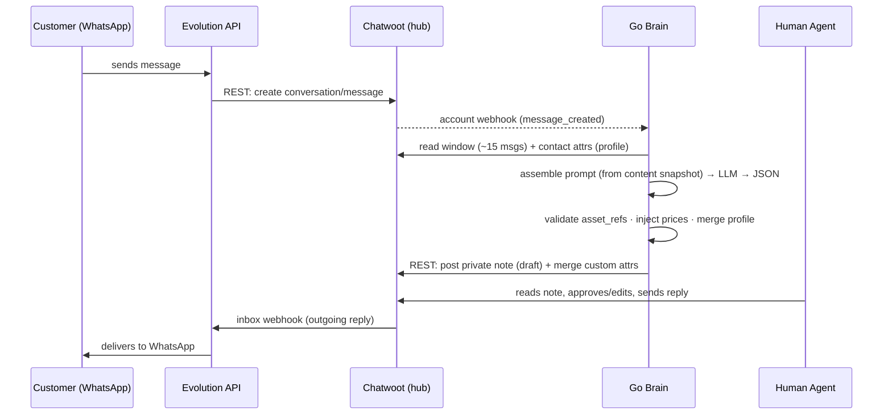

# xpayment AI Sales Copilot — Design Documentation

## What this is

[xpayment](https://xpayment.kz) is a Kaspi Pay integration for Kazakhstani merchants: connect a Kaspi virtual cashier and accept payments by QR, payment link, and remote invoice, plus a REST API (create payment, payment links, refunds, webhooks). Leads arrive from Instagram ads redirected to WhatsApp, and conversations happen in Russian or Kazakh.

This documentation set describes the **AI sales copilot** that supports those conversations. Incoming WhatsApp messages land in a shared team inbox (Chatwoot). A **stateless, file-backed Go service** — the **brain**, living in `xpayment-crm` — reads the recent conversation and lead profile **from Chatwoot**, drafts a reply (answer text + which media to attach + what it learned about the lead) with an LLM, and writes that draft **back to Chatwoot as a private note** for a human to approve and send (**suggest-only**). Its persona, knowledge base, prices, and media catalog are **files in a content repo** (`xpayment-content`); it has **no database of its own**.

This file is the canonical home for the **Decisions** and the **Architecture**. The other documents reference these and never restate them.

---

## Decisions

These are non-negotiable for v1. Other files refer to them as "per Decision N".

1. **Chatwoot is the single source of truth** for all conversational state: contacts, conversations, messages, status (labels), callbacks (snooze), and grouping (contact merge).
2. **The brain is stateless and file-backed — no database.** Its persona, knowledge base, media metadata, and prices are **files in the content repo** (`xpayment-content`), loaded into an immutable in-memory snapshot. Conversations and the lead profile live in Chatwoot. The brain reads a checked-out folder + Chatwoot's REST API — it has **no database of its own**.
3. **Topology is hub-and-satellites.** Chatwoot is the hub; Evolution API and the brain are satellites that talk only to Chatwoot, never to each other.
4. **Channel-agnostic.** The brain's entry point takes a `chatID`; the same code serves WhatsApp now and any other channel later, because everything funnels through Chatwoot.
5. **WhatsApp gateway is Evolution API** (Baileys / unofficial WhatsApp Web). The official **Cloud API** is the documented migration path, gated behind a swappable adapter.
6. **Suggest-only in v1.** The brain returns a draft as a Chatwoot **private note**; a human approves and sends. A confidence threshold gates a later auto-send phase. The brain never sends to WhatsApp directly — Chatwoot does.
7. **No vector database.** Media and knowledge are selected by **LLM-as-selector**: the whole knowledge base and the whole media catalog are loaded into a cached prompt, and the model returns the names (refs) of the items it wants. The graduation path (topic-routing, then pgvector) is a documented future option, not used now.
8. **Prices are single-sourced.** Canonical numbers live in one place (`pricing.json` in the content repo). Knowledge-base text contains only **tokens** like `{{price.growth}}` / `{{limit.growth}}`; the model never writes price/limit numerals; Go renders the real values **after** the model, from `pricing.json`.
9. **Two memory horizons.** The **window** (last ~15 messages of the current conversation, fetched from Chatwoot) and the **profile** (structured lead facts stored as Chatwoot **contact custom attributes**, merged additively — never null a known field). No running summary in v1.
10. **Hexagonal / ports-and-adapters.** The brain talks to the outside through interfaces (`ContentSource`, `ChatwootReader`, `ChatwootWriter`, `Drafter`, `Prices`, `Catalog`), so the core is built and tested before any integration exists.
11. **Integration mechanism.** The brain receives events via a Chatwoot **account-level webhook** (`message_created`) and writes back via Chatwoot's **REST API** (private note + custom attributes). Chatwoot ↔ WhatsApp is bridged by Evolution's native Chatwoot integration. Chatwoot **AgentBot** is a documented alternative, but it puts conversations into a bot-managed "pending/handoff" state; the account-webhook is preferred for a persistent copilot.
12. **The brain is a standalone, stateless service.** It runs as its own Go service in `xpayment-crm`, reusing the main `xpayment` repo's conventions (multi-stage Dockerfile, `slog`+OTel, mockery tests) — but with **no Postgres and no migrations** (Decision 2). **Git is the config lifecycle**: a branch/working copy is a draft, merge-to-`main` is publish, `git revert` is rollback, `git log`/`git blame` is the audit, a PR is review. Consequence: there is **no admin API and no cross-service auth to build in v1** (see [08-admin-ui.md](08-admin-ui.md)).

---

## Architecture

### Hub-and-satellites

Chatwoot is the hub. Evolution and the brain are satellites; they never talk to each other (Decision 3).

```
                                  ┌──────────────────────────────────────┐
   ┌──────────┐    WhatsApp Web   │              CHATWOOT                 │
   │ Customer │◀────(Baileys)────▶│        (single source of truth)      │
   │ WhatsApp │                   │  contacts · conversations · messages │
   └──────────┘                   │  labels(status) · snooze(callback)   │
        ▲                         │  merge(grouping)                     │
        │                         └───┬───────────────▲──────────────────┘
        │ outgoing reply              │ account        │ REST write-back
        │ (inbox webhook)             │ webhook        │  • private note (draft)
        ▼                             │ message_       │  • contact custom attrs
   ┌──────────┐   REST (create       │ created        │    (profile)
   │ EVOLUTION│   conversation/msg)   ▼                │
   │   API    │──────────────────▶ ┌──────────────────┴──────────────────┐
   └──────────┘                    │  GO BRAIN (stateless, file-backed)   │
   (satellite)                     │  HandleMessage(chatID, msg) → Draft  │
                                   │  reads config from xpayment-content  │
                                   │            (satellite)               │
                                   └──────────────────────────────────────┘
```

### Three layers

| Layer | Components | Responsibility |
|---|---|---|
| **Channel / transport** | Evolution API + Chatwoot | Move messages between the customer's WhatsApp and the shared inbox; own all conversational state. See [01-infrastructure.md](01-infrastructure.md). |
| **Brain** | Standalone Go service | On each inbound message, read context, decide *what to respond*, return a draft. Stateless, file-backed. See [02-assistant-brain.md](02-assistant-brain.md), [04-service-and-deployment.md](04-service-and-deployment.md). |
| **Content / config** | KB topics, media catalog, prices, persona — as **files in `xpayment-content`** | The authored material the brain reasons from; **git is the lifecycle**. See [03-content-and-data.md](03-content-and-data.md), [08-admin-ui.md](08-admin-ui.md). |

### Ownership

| Concern | Owner |
|---|---|
| Contacts | Chatwoot |
| Conversations | Chatwoot |
| Messages | Chatwoot |
| Status / pipeline stage | Chatwoot — **labels** |
| Callbacks / follow-up | Chatwoot — **snooze** |
| Grouping (numbers, employees) | Chatwoot — **contact merge** |
| Assistant config (persona, guardrails) | **`xpayment-content` files** (`assistant.json`), loaded by the brain |
| Knowledge base (topics) | **`xpayment-content` files** (`knowledge/*.md`) |
| Media metadata | **`xpayment-content` files** (`media.json`); binaries in `media/` (Git LFS / object storage) |
| Prices | **`xpayment-content` file** (`pricing.json`) — the single source |
| Lead profile / qualification | Computed by the brain → written to Chatwoot **contact custom attributes** |

The brain owns *the decision logic*; Chatwoot owns *everything about the conversation*; the content repo owns *the authored config*. The lead profile is the one piece the brain computes but does not store — it lives on the Chatwoot contact (Decision 9).

### End-to-end message flow



1. Customer sends a WhatsApp message.
2. Evolution (WhatsApp Web) receives it and **calls Chatwoot's REST API** to create the conversation/message.
3. Chatwoot fires the **account-level webhook** (`message_created`) to the brain (Decision 11).
4. The brain reads the **window** and the **profile** from Chatwoot using the `chatID` (Decision 9). First message vs. mid-conversation is not a code branch — it is just how much Chatwoot returns.
5. The brain assembles the prompt (cached prefix from the content snapshot + dynamic suffix), calls the LLM, and gets back structured JSON.
6. The brain post-processes: validate/resolve `asset_refs`, inject prices from `pricing.json`, additively merge the profile, apply a status label.
7. The brain writes back via REST: a **private note** (the draft) plus **contact custom attributes** (the profile).
8. A human agent reads the note, approves or edits it, and sends the real reply in Chatwoot.
9. Chatwoot's **inbox webhook** carries the outgoing reply to Evolution → WhatsApp → customer.

### Named assumption

"Channel-agnostic" (Decision 4) holds **because everything funnels through Chatwoot**. The brain takes a `chatID` and never learns which transport produced it; adding Instagram or Telegram later is a Chatwoot inbox change, not a brain change. A future entry point that bypasses Chatwoot would reopen the question of where conversational state lives — out of scope for v1.

### Config lifecycle = git (consequence of Decision 12)

The brain's persona, knowledge, prices, and media catalog are **files in `xpayment-content`** (Decision 2). Editing them *is* the admin workflow: a branch/working copy is a **draft**, merge-to-`main` is **publish**, `git revert` is **rollback**, `git log`/`git blame` is the **audit**, and a PR is **review**. There is therefore **no admin API and no cross-service auth** to build in v1; a content-editing UI can be added later that commits to the same files. Details in [08-admin-ui.md](08-admin-ui.md).

---

## Repo layout (the standalone brain service)

Hexagonal, mirroring the main repo's package roles (detail in [04-service-and-deployment.md](04-service-and-deployment.md)):

```
xpayment-crm/                 # the brain — stateless, no database
  cmd/                        # main.go — load content snapshot, start HTTP server, graceful shutdown
  internal/
    domain/                   # Draft, Message, ChatID, Media, Snapshot … (no external deps)
    usecase/assistant/        # HandleMessage + the ports (Decision 10)
    infrastructure/
      content/                # ContentSource: load + validate xpayment-content → atomic Snapshot; git pull on reload
      chatwoot/               # ChatwootReader / ChatwootWriter — REST adapter
      anthropic/              # Drafter — LLM adapter (prompt caching)
      config/                 # env loading (getEnv pattern)
    ports/http/               # Chatwoot webhook receiver + GitHub reload webhook + chi router
  docs/                       # this documentation set

xpayment-content/             # the CONFIG — a separate repo, edited with git (Decision 2)
  assistant.json  pricing.json  media.json   # persona/guardrails · prices · media catalog
  knowledge/*.md                              # topic bodies (front-matter + tokens, no numerals)
  media/                                      # binaries (Git LFS / object storage)
```

---

## Roadmap

**Phase 1 — Crawl (mostly configuration).** Self-host Chatwoot and Evolution; connect them via Evolution's native Chatwoot integration; **import *and mine* the ~100 existing WhatsApp chats**; configure labels (status), snooze (callbacks), contact merge (grouping), and canned responses; pre-define the contact custom attributes the profile will use.

> **Mining the existing conversations is the load-bearing first task.** Importing chats is not mining them. The real history reveals the *actual* questions customers ask and the *actual* Russian/Kazakh phrasing they use. Mining seeds both the knowledge base (the topics and answers) and the **golden set** (real questions used as evals — see [07-testing-and-evals.md](07-testing-and-evals.md)). Marketing copy supplies the answers; the conversations supply the questions.

**Phase 2 — Walk (the brain).** Build `HandleMessage` as a callable core, tested with mocked ports (no external services); load the **content snapshot** from `xpayment-content` into a cached prompt with **reload-on-git-push**; structured-output drafting; `asset_ref` validation and price injection; a **Playground CLI** to test edits against the working copy; register the brain on the Chatwoot account webhook; write drafts as **private notes** and the profile as **custom attributes**. Suggest-only.

**Phase 3 — Run (scale).** An **optional content-editing UI** that commits to `xpayment-content` (git stays the source of truth); a golden-set eval gate (CI on the content repo); **confidence-gated auto-send** via Chatwoot's outgoing-message API; new channels through Chatwoot; **Evolution → Cloud API** migration behind the adapter.

Per-phase acceptance criteria (Definition of Done) are in [07-testing-and-evals.md](07-testing-and-evals.md).

---

## Index / reading order

| # | File | What it covers |
|---|---|---|
| — | **README.md** (this file) | Overview, Decisions, Architecture, Repo layout, Roadmap |
| 1 | [01-infrastructure.md](01-infrastructure.md) | Evolution ↔ Chatwoot wiring, the two webhook kinds, brain ↔ Chatwoot, operations (backups, TLS) |
| 2 | [02-assistant-brain.md](02-assistant-brain.md) | The brain at runtime: `HandleMessage`, context-on-read, prompt assembly, JSON contract, post-processing, ports, memory, worked example |
| 3 | [03-content-and-data.md](03-content-and-data.md) | The **content repo**: file shapes (assistant/pricing/knowledge/media), the snapshot loader + validation, the **git config lifecycle** |
| 4 | [04-service-and-deployment.md](04-service-and-deployment.md) | The standalone service: repo layout, Dockerfile, full-stack compose, **content checkout & reload**, startup, observability, deploy |
| 5 | [05-configuration.md](05-configuration.md) | **Canonical env-var catalog**, `.env` pattern, secrets |
| 6 | [06-api-and-contracts.md](06-api-and-contracts.md) | The brain's HTTP surface + the exact Chatwoot REST/webhook contracts |
| 7 | [07-testing-and-evals.md](07-testing-and-evals.md) | Unit/integration tests, the golden-set eval harness, CI, Definition-of-Done |
| 8 | [08-admin-ui.md](08-admin-ui.md) | The admin model: the **git/GitOps workflow** for config & KB + the Playground CLI |
| 9 | [09-product-and-ops.md](09-product-and-ops.md) | Vision, KPIs, operating procedure, compliance, cost, risks, **open-questions register** |
| — | [GLOSSARY.md](GLOSSARY.md) | Every term, in clusters, cross-linked to the file that goes deep |

---

## Definition of Ready — "is this set enough to build from?"

The documentation is complete when all of these hold (verify by reading the set end-to-end):

1. **Stand up:** an engineer can bring up Chatwoot + Evolution + the brain locally from [04](04-service-and-deployment.md) + [05](05-configuration.md) alone — the brain clones/mounts the `xpayment-content` repo and needs **no database**; every env var is in `05`; the tunnel/webhook wiring is in `04`/`01`.
2. **Implement:** `HandleMessage` and the Chatwoot adapter can be built from [02](02-assistant-brain.md) + [06](06-api-and-contracts.md) without guessing a contract — every port maps to a documented REST call.
3. **Test:** [07](07-testing-and-evals.md) lets someone write the unit suite + the golden-set gate and know the pass bar.
4. **Configure:** an operator can set up the Chatwoot inbox, custom attributes, labels, and canned responses from [01](01-infrastructure.md) + [09](09-product-and-ops.md) checklists, and edit the bot's config/KB/prices as files per [03](03-content-and-data.md)/[08](08-admin-ui.md).
5. **Align:** a non-engineer can read this README + [09](09-product-and-ops.md) and correctly state what the product does, who it's for, how a rep uses it, what it costs, and what legal questions are open.
6. **No orphans:** every per-file *Open Questions* entry appears in the consolidated register in [09](09-product-and-ops.md) with an owner.
